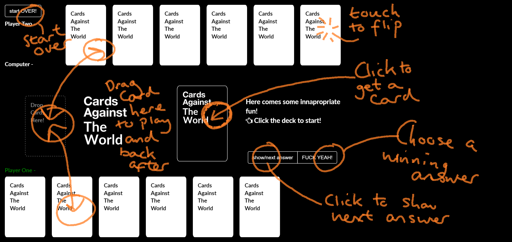

# Cards Against Humanity

This is a browser based version of the popular Cards Against Humanity card game. It uses jQuery's draggable and droppable features, bootstrap CSS buttons and sweetAlert popups. The game uses a reduced subset of the actual game cards but more will be added in the future. In addition, the game is not able to handle two card answers at this time. This ability will be added in further updates.

### Screenshots

### Features
* Drag and drop cards to give it an authentic feel.
* The ability to place cards anywhere on the table top, just like in real life.
* Touch screen enabled!!
* Score board with alternating colors to help keep track of who's turn it is.

### Credits
* [jQuery](http://jquery.com)
* [jQuery UI](http://jqueryui.com)
* [jQuery Flip](http://nnattawat.github.io/flip/)
* [Google Web Fonts - Lato:400](http://google.com/fonts)
* [Sweet Alert](http://t4t5.github.io/sweetalert/)
* [BootStrap](https://netdna.bootstrapcdn.com)
* [Font Awesome](http://fortawesome.github.io/Font-Awesome/)

### Known Issues
* Is not yet able to deal with cards that require two responses.
* Is not designed to be played on smaller screens due to the nature of the game.

### Disclaimer
Cards Against Humanity is licenced under Creative Commons [Cards Against Humanity](http://cardsagainsthumanity.com/).
